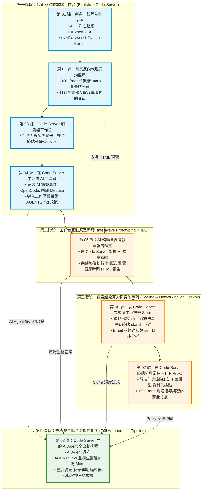

# HPC 實戰教學系列手冊 (HPC Tutorial Series)
### —— 以 Code-Server Web UI 為核心工作台的超級電腦全流程實戰指南

歡迎來到高效能運算（High Performance Computing, HPC）實戰教學系列手冊！本教學專為在國家高速網路與計算中心（NCHC）創進一號（Taiwania 1 / f1）等超級電腦與叢集環境中的使用者、研究人員與開發者設計。

> [!IMPORTANT]
> **🚀 現代化超級電腦開發核心理念：以 Code-Server Web UI 為中央工作台 (Unified Cockpit)**  
> 過去使用超級電腦，開發者常陷於「黑底命令列 + Vim + 多重 SSH 視窗 + 繁瑣 scp 下載看圖」的低效流程中。  
> 本系列教學全面採用**現代化雲端 IDE 工作流**：  
> 在第 01~02 章完成「一次性起跑」（SSH/2FA 帳號初始化與反向代理理解）後，**自第 03 章起，您將徹底關閉本地 SSH 終端機，所有研發工作 100% 進駐瀏覽器中的 Code-Server (VS Code Web)！**  
> 不論是**編輯代碼、Git 視覺化比對、Jupyter 筆記本運算、AI Copilot 智慧輔助、Slurm 批次排程撰寫、一鍵提交與任務效能監控**，全都在同一個瀏覽器分頁中無縫完成！

---

## 📚 目錄索引 (Tutorial Index)

| 章節編號 | 教學主題 | 說明與適用場景 | 核心工作台角色 | 連結 |
| :---: | :--- | :--- | :--- | :---: |
| **01** | **創進一號登入與環境管理 (SSH, 2FA & uv)** | 登入節點連線 (`f1-ilgn01`)、IDExpert 2FA、DTN 傳檔、三大儲存架構 (`/home` vs `/work1`) 與極速 Python 套件管理 `uv`。 | **工作台地基**<br>初始化 `$HOME` 與建立 `/work1` Python Kernel | [前往章節](./01-f1-ssh-and-2fa/) |
| **02** | **網頁服務反向代理 (Web Service & Reverse Proxy)** | 剖析國網中心 Open OnDemand (OOD) 子路徑反向代理架構 (`/rnode/<host>/<port>/`)，動態 Port 分配，防範 `nohup` 的 `SIGTTIN` 死鎖。 | **工作台通道**<br>打通從外網瀏覽器直通超算服務的連線機制 | [前往章節](./02-web-service-reverse-proxy/) |
| **03** | **超級電腦運行 Code-Server (VS Code Web)** | 運用反向代理打造全功能瀏覽器 IDE，新手首選登入節點 (`tmux` 背景常駐) 即開即用，深入實習**整合終端、Git、Jupyter 與除錯實務**！ | **工作台核心**<br>告別外部 SSH，從此常駐瀏覽器開發環境 | [前往章節](./03-code-server-on-hpc/) |
| **04** | **AI 開發工具鏈與 AGENTS.md 治理規範** | 在 Code-Server 中配置 AI 插件、終端執行 OpenCode CLI 串接國網 Medusa 地端大模型，並導入超算專屬 **`AGENTS.md`** 規範。 | **工作台大腦**<br>在 Code-Server 視窗內直接召喚 AI 輔助開發 | [前往章節](./04-ai-developer-tools/) |
| **05** | **AI 輔助生醫管線 (FASTQ 質控登入節點實作)** | 以生醫 FASTQ 為具象化案例（思維全領域通用），在 Code-Server 內指揮 AI 編寫管線、整合終端跑測試，並於瀏覽器即時預覽互動 HTML 報表。 | **工作台實踐**<br>小數據原型開發、終端測試與報告即時預覽 | [前往章節](./05-ai-assisted-bio-pipeline/) |
| **06** | **Slurm 語法精講、seff 效能分析與容器實務** | 在 Code-Server 編輯器編寫 `.slurm`，以內建終端充當 **Slurm 指揮調度中心** 派送 `ct112`/`cf112`、`seff` 效能分析與 Singularity 容器。 | **工作台指揮所**<br>語法高亮編寫排程、內建終端派送與監控 | [前往章節](./06-slurm-syntax-and-job-management/) |
| **07** | **突破網路隔離：計算節點安全聯網代理 (HTTP Proxy)** | 於 Code-Server 終端分頁常駐 Login Node 代理服務，解決計算節點無外網無法下載模型或資料的痛點，以 InfiniBand IP 穿透防火牆。 | **工作台通訊塔**<br>背景常駐代理隧道，賦予計算任務連網能力 | [前往章節](./07-compute-node-proxy/) |
| **08** | **AI Agent 自動化排程 (將生醫管線派送至 Slurm)** | 【全系列集大成】在 Code-Server 中引導 AI Agent 自動將分析管線重構為 Slurm 批次作業，於整合終端派送並在編輯器即時檢視日誌串流！ | **工作台集大成**<br>全自動化 AI 排程派送、監控與成果交付 | [前往章節](./08-ai-agent-slurm-pipeline/) |

---

## 🗺️ 學習路徑與課程相依性 (DAG Roadmap)

本系列手冊以 **Code-Server 瀏覽器工作台** 為主軸貫穿四大研發階段：



---

## 🖥️ HPC 叢集基礎架構簡介

在標準 HPC 叢集中，節點通常分為兩大類：

```text
[ 外部網際網路 Internet ]
       ▲
       │ (外網網卡)
┌──────┴──────────────────────────────────────┐
│  登入節點 (Login Node: f1-ilgn01 等)         │
│  • 供使用者編譯代碼、管理檔案、提交作業      │
│  • 具備外網連線，嚴禁在此執行長時重度運算     │
└──────┬──────────────────────────────────────┘
       │ (高速內部網路：InfiniBand / Internal LAN: 10.200.160.0/24)
┌──────┴──────────────────────────────────────┐
│  計算節點 (Compute Nodes: icpnq101 等)       │
│  • 由 Slurm 排程系統管理，具備龐大 CPU/GPU  │
│  • 防火牆完全隔離，預設無法連線外部網際網路   │
└─────────────────────────────────────────────┘
```

當深度學習模型（如 Hugging Face / TorchHub）或自動下載指令需要在計算節點執行時，便需要透過登入節點搭建安全的代理隧道（Proxy Tunnel）。請參考 **第 07 章** 深入了解！

---

## 🔗 國網中心創進一號 (Taiwania 1 / f1) 官方技術手冊

本教程深度整合了國網中心官方指南與實戰經驗，相關官方規範請參閱：
* [創進一號服務概觀與總目錄 (f1-manual)](https://man.twcc.ai/@f1-manual/manual)
* [前端伺服器（登入與傳輸節點）連線說明](https://man.twcc.ai/@f1-manual/Front_end_server)
* [登入節點與雙因子認證 (2FA) 操作流程](https://man.twcc.ai/@f1-manual/login_node)
* [Slurm 操作簡介與使用規範](https://man.twcc.ai/@f1-manual/slurm_instructions)
* [Slurm 佇列分區表與核心/記憶體規格 (Partition)](https://man.twcc.ai/@f1-manual/partition)
* [Slurm 作業提交與管理範例 (sbatch / salloc)](https://man.twcc.ai/@f1-manual/slurm_job_example)
* [Modules 環境模組操作說明與使用規範](https://man.twcc.ai/@f1-manual/modules_instructions)
